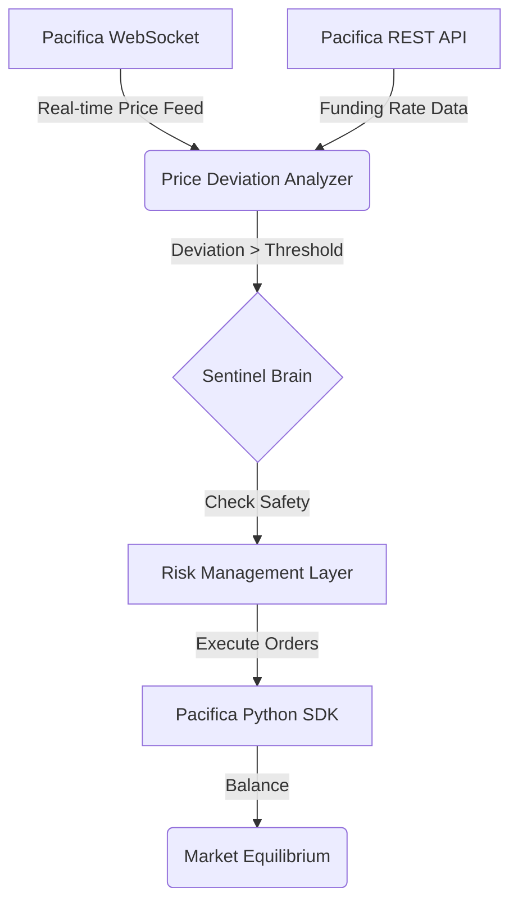

# Pacifica Sentinel 🌊 `v1.0.0-beta`
> **The Active Liquidity Immune System for Perpetual DEXs**

**Pacifica Sentinel** is an autonomous AI agent designed as a "Liquidity Immune System" for the Pacifica ecosystem. The system performs real-time market health monitoring and intervenes to mitigate systemic risks, ensuring price stability and protecting users from adverse market conditions.

---

## 🚩 The Problem: Liquidity Fragility

In the world of Perpetual Futures Exchanges (**Perp DEXs**), extreme volatility often leads to liquidity gaps. When liquidity becomes thin, the following issues arise:

* **Oracle Divergence:** The on-chain price (Mark Price) deviates significantly from the fair asset value (Oracle Price), leading to unfair liquidations for traders.
* **Funding Rate Instability:** "Flash Crashes" distort funding mechanisms, causing unnecessary costs for position holders.
* **Systemic Erosion of Trust:** Repeated price dislocations discourage professional liquidity providers (LPs) and institutional funds.

---

## 🛡️ Our Solution: The Sentinel Architecture

Sentinel operates as a non-stop monitoring and execution layer. It doesn't just trade for profit; it trades for **Equilibrium**.

### 1. Autonomous Monitoring (The Pulse)
Utilizing Pacifica's low-latency **WebSocket** data streams, Sentinel tracks the spread between Mark and Oracle prices. It identifies "Liquidity Glitches"—anomalies indicating market failure rather than organic movements.

### 2. The Liquidity Shield (Active Hedging)
When critical deviation is detected (e.g., `>0.5%`), Sentinel automatically triggers **Delta-Neutral Hedging** strategies:
* **Market Balancing:** Executes counter-orders via the *Pacifica Python SDK* to absorb volatility and push the Mark price back to the Oracle anchor.
* **Risk Mitigation:** Proactively prevents liquidation engines from firing on artificial "wicks."

### 3. Funding Rate Stabilization
Sentinel monitors `next_funding` estimates. By providing counter-flow liquidity, it helps stabilize funding fees, ensuring the mechanism remains a healthy driver for price convergence.

---

## 🏗️ Technical Workflow

---

## 🗺️ Roadmap & Versioning

### v1.0.0 (Hackathon Edition) - Current
- [x] Initial Architecture & Core Logic.
- [x] REST/WebSocket API Integration for real-time monitoring.
- [x] Price Deviation Analyzer (Mark vs. Oracle).
- [ ] Risk Management Layer: Position and margin checks before execution.
- [ ] Automated Order Execution via Pacifica SDK.
- [ ] Builder Program integration with `builder_code`.

### v1.1.0 (Post-Hackathon Optimization)
- [ ] Multi-Pair Support: Expanding the immune system to all trading pairs.
- [ ] Dynamic Thresholds: AI-driven adjustment of deviation triggers based on historical volatility.
- [ ] Alerting System: Real-time Telegram/Discord notifications for liquidity anomalies.

### v2.0.0 (The DeFi Composability Vision)
- [ ] Public Sentinel Vaults: Allowing users to deposit liquidity into smart contracts to fund hedging operations, earning a share of Funding Rate yields and Builder rewards while securing the ecosystem.

---

## 🛠️ Technical Integration

| Component | Technology |
|---|---|
| **Language** | Python 3.10+ |
| **SDK** | Pacifica Python SDK (Official) |
| **Data Source** | `GET /api/v1/info/prices` & WebSocket stream |
| **Infrastructure** | Python Cloud-native (24/7 Uptime) |

---

## 🤝 Connect with Small Piece Labs

*Small solutions, vital impact. 🏗️ Scaling Privacy.*

* 📧 **Email:** smallpiecelabs@gmail.com
* 🐦 **X (Twitter):** [@SmallPieceLabs](https://twitter.com/SmallPieceLabs)
* 📺 **YouTube:** [@smallpiecelabs](https://youtube.com/@smallpiecelabs)
* 💬 **Telegram:** [@platink](https://t.me/platink)

> *Built exclusively for the Pacifica 2026 Hackathon.*
